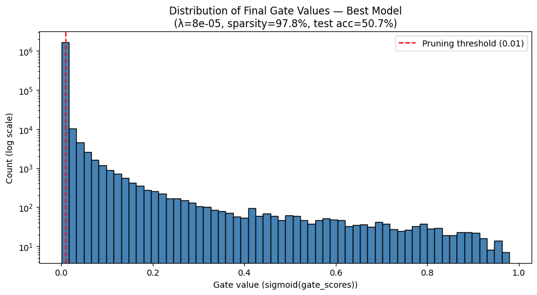
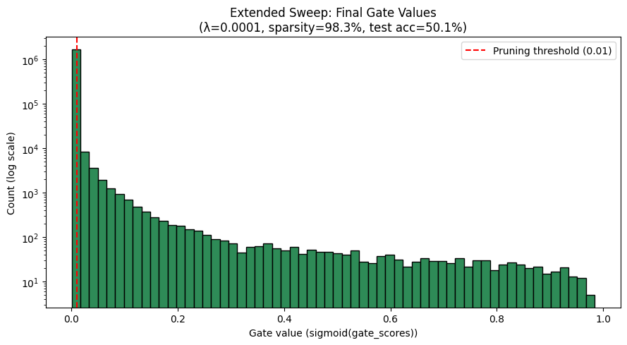

# Case-Study
# Self-Pruning Neural Network — Tredence AI Engineer Case Study

A PyTorch implementation of a **Self-Pruning MLP** for CIFAR-10 image classification. The network learns to prune its own connections *during* training by using learnable gate parameters — no post-training pruning required.

---

## Problem Statement

Deploying large neural networks is often constrained by memory and compute budgets. This project addresses that by building a network that **learns which weights are unnecessary** and removes them automatically during training, using a custom regularization approach.

---

## Core Idea

Each weight in the network is paired with a learnable **gate score**. During the forward pass:

```
gates = sigmoid(gate_scores)          # values in (0, 1)
pruned_weights = weights × gates      # element-wise
output = linear(input, pruned_weights, bias)
```

A gate value near **0** effectively removes that weight from the network, creating a sparse architecture.

The total loss combines classification loss and a sparsity penalty:

```
Total Loss = CrossEntropyLoss + λ × SparsityLoss
```

where `SparsityLoss` is the **L1 norm** of all gate values (sum of sigmoid-gated scores), encouraging them to collapse to zero.

---

## Architecture

| Component | Details |
|---|---|
| **PrunableLinear** | Custom linear layer with `weight`, `bias`, and `gate_scores` as learnable parameters |
| **SelfPruningMLP** | 3-layer MLP: `3072 → 512 → 256 → 10` using `PrunableLinear` layers |
| **Dataset** | CIFAR-10 (downloaded automatically via `torchvision`) |
| **Optimizer** | Adam — gate scores trained at `5×` the base learning rate |

---


## ⚙️ Hyperparameters

| Parameter | Value |
|---|---|
| Epochs | 15 |
| Batch Size | 128 |
| Learning Rate | 1e-3 |
| λ values (primary) | 3e-5, 5e-5, 8e-5 |
| λ values (extended) | 1e-6, 1e-5, 1e-4 |
| Pruning Threshold | 1e-2 |

> **Note:** Sparsity loss is not applied for the first 2 epochs to allow the network to warm up.


## 📊 Results

The notebook trains three models with different λ values and reports:

- ✅ **Test Accuracy** — classification performance after pruning
- ✅ **Sparsity Level (%)** — percentage of gates below the pruning threshold
- ✅ **Gate Distribution Plot** — histogram showing spike at 0 (pruned) and near 1 (active)

A higher λ produces a sparser network, potentially at the cost of some accuracy — the classic **sparsity vs. accuracy trade-off**.

### Gate Value Distribution — Primary Sweep (Best Model)
> λ=8e-05 | Sparsity: **97.8%** | Test Accuracy: **50.7%**



### Gate Value Distribution — Extended Sweep (Best Model)
> λ=0.0001 | Sparsity: **98.3%** | Test Accuracy: **50.1%**



The large spike at gate values near **0** confirms the network is successfully pruning the vast majority of its connections while retaining a small set of high-importance weights.

---

## Key Implementation Details

- **Gradient flow**: Both `weight` and `gate_scores` receive gradients correctly through the element-wise multiplication.
- **Separate learning rates**: Gate scores are updated at `lr × 5` to accelerate gate collapse.
- **Weight decay**: Applied only to base weights (`1e-4`), not to gate scores.
- **Reproducibility**: Seed fixed at `42` for each run.

---

## Evaluation Criteria

1. **Correctness of PrunableLinear** — gated weight mechanism and gradient flow
2. **Sparsity Loss Implementation** — correct L1 penalty over all gates
3. **Results Quality** — meaningful sparsity with competitive accuracy
4. **Code Quality** — clean, commented, and easy to follow

---

## 🛠️ Tech Stack


